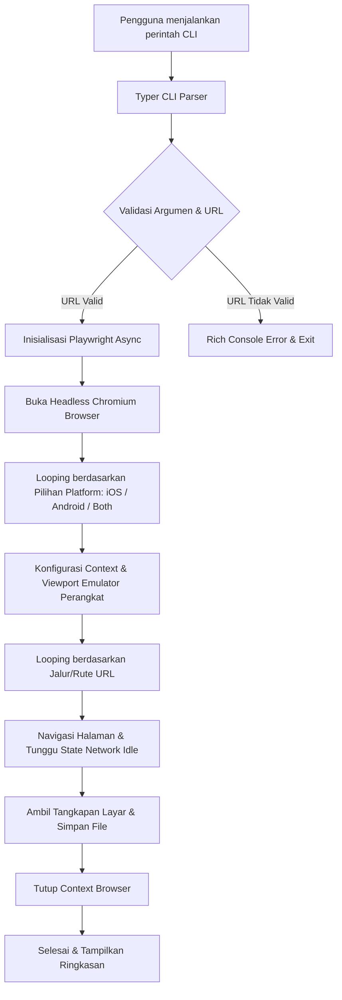

# MobileSnap 📸

MobileSnap adalah alat CLI (Command Line Interface) berbasis Python yang dirancang untuk mengotomatisasi pengambilan tangkapan layar (screenshot) App Store & Google Play Store dengan presisi piksel tinggi langsung dari server pengembangan lokal (seperti Astro, Next.js, React, atau Vue).

---

## 🏗️ Arsitektur Sistem

MobileSnap dirancang dengan fokus pada efisiensi, keandalan, dan kemudahan penggunaan. Berikut adalah diagram alur kerja utama aplikasi:



### Komponen Utama

1. **Parser CLI ([main.py](file:///d:/Deweb/MobileSnap/mobilesnap/main.py))**: Menggunakan library `Typer` untuk memproses input parameter dari pengguna dengan aman dan intuitif (termasuk pilihan vendor iOS & Android).
2. **Mesin Otomatisasi Browser**: Berbasis `Playwright` Async API untuk menjalankan proses Chromium tanpa kepala (*headless*).
3. **Pengaturan Emulator Presisi**:
   - **Skala Perangkat (DPI)**: Ditetapkan ke `device_scale_factor=3` untuk menghasilkan kualitas tangkapan layar yang sangat tajam (Retina/High DPI) sesuai standar rilis.
   - **Agen Pengguna (User Agent)**: Dikonfigurasi dinamis sesuai platform target (iOS menggunakan user agent iPhone, Android menggunakan user agent Google Pixel 7) untuk merender halaman mobile dengan tepat.
4. **Sinkronisasi Hidrasi Web**: Menggunakan `page.wait_for_load_state("networkidle")` untuk mendeteksi ketika semua aset CSS, JavaScript, dan visual selesai dimuat sebelum tangkapan layar diambil. Ini sangat penting untuk framework modern seperti Astro.

---

## 📱 Spesifikasi Dimensi Target

MobileSnap secara otomatis mengambil gambar untuk perangkat berikut berdasarkan platform yang dipilih:

### iOS (Apple App Store)
| Nama Layar | Resolusi (Piksel) | Rasio Aspek | Output File Contoh |
| :--- | :--- | :--- | :--- |
| **6.7" Display** | 1290 x 2796 | 19.5:9 | `6.7_inch_home.png` |
| **6.5" Display** | 1242 x 2688 | 19.5:9 | `6.5_inch_home.png` |

### Android (Google Play Store)
| Nama Layar | Resolusi (Piksel) | Rasio Aspek | Output File Contoh |
| :--- | :--- | :--- | :--- |
| **Android Phone** | 1080 x 2400 | 20:9 | `android_phone_home.png` |
| **Android Tablet (10")** | 1600 x 2560 | 16:10 | `android_tablet_home.png` |

---

## 🚀 Cara Instalasi

Pastikan Anda telah menginstal Python versi 3.8 ke atas pada sistem operasi Windows Anda.

1. **Instalasi Paket Lokal**
   Buka terminal di direktori proyek `d:\Deweb\MobileSnap` lalu jalankan perintah berikut untuk menginstal dalam mode dapat diedit (*editable mode*):
   ```powershell
   pip install -e .
   ```

2. **Instalasi Driver Browser Playwright**
   Unduh pustaka browser Chromium yang dibutuhkan oleh Playwright:
   ```powershell
   playwright install chromium
   ```

---

## 💻 Panduan Penggunaan

Aplikasi ini menerima 4 argumen utama:

| Parameter | Singkatan | Deskripsi | Standar (Default) | Pilihan |
| :--- | :--- | :--- | :--- | :--- |
| `--url` | `-u` | **(Wajib)** URL server lokal. | - | - |
| `--paths` | `-p` | Jalur/rute halaman yang dipisahkan tanda koma. | `/` | - |
| `--output`| `-o` | Nama direktori tempat menyimpan gambar. | `mobilesnap_output` | - |
| `--platform`| `-l`| Platform target tangkapan layar. | `ios` | `ios`, `android`, `both` |

### Contoh Perintah Penggunaan

#### 1. Pengambilan Halaman iOS Saja (Default)
Mengambil gambar halaman beranda `/` untuk perangkat iOS:
```powershell
mobilesnap --url http://localhost:4321
```

#### 2. Pengambilan Halaman Android Saja
Mengambil gambar halaman beranda `/` untuk perangkat Android:
```powershell
mobilesnap --url http://localhost:4321 --platform android
```

#### 3. Pengambilan 2 Vendor Sekaligus (iOS dan Android)
Mengambil gambar untuk halaman beranda dan scan untuk kedua platform sekaligus, lalu disimpan ke folder kustom `hasil_store`:
```powershell
mobilesnap --url http://localhost:4321 --paths "/, /scan" --platform both --output hasil_store
```

#### 4. Menampilkan Menu Bantuan
Melihat daftar lengkap perintah dan keterangan opsi:
```powershell
mobilesnap --help
```

---

## 🛠️ Penanganan Masalah & Kegagalan

- **Server Belum Aktif**: Jika server di URL target tidak aktif atau tidak dapat dijangkau, program akan menampilkan pesan kegagalan merah menggunakan Rich console tanpa menghentikan paksa sistem operasi.
- **Normalisasi URL**: Jika Anda lupa memasukkan skema `http://` atau `https://`, aplikasi akan secara otomatis menambahkan `http://` sebelum melakukan navigasi browser.
- **Nama File Aman**: Karakter khusus atau garis miring (`/`) pada rute akan secara otomatis diubah menjadi karakter garis bawah (`_`) yang aman bagi sistem penyimpanan Windows.
