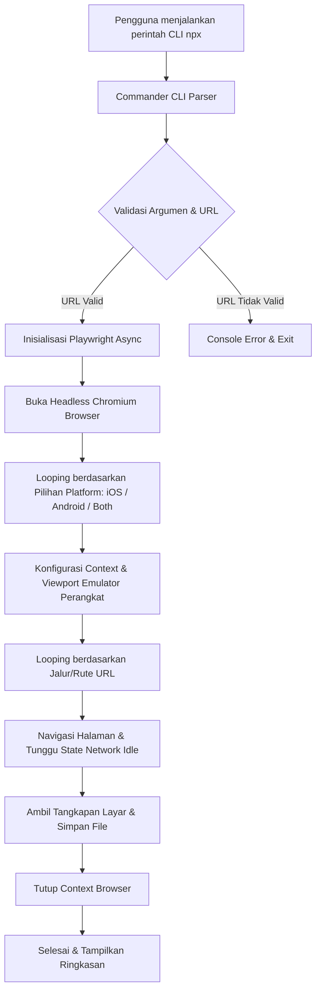

# MobileSnap 📸

MobileSnap adalah alat CLI (Command Line Interface) berbasis Node.js yang dirancang untuk mengotomatisasi pengambilan tangkapan layar (screenshot) App Store & Google Play Store dengan presisi piksel tinggi langsung dari server pengembangan lokal (seperti Astro, Next.js, React, atau Vue).

---

## 🏗️ Arsitektur Sistem

MobileSnap dirancang dengan fokus pada efisiensi, keandalan, dan kemudahan penggunaan. Berikut adalah diagram alur kerja utama aplikasi:



### Komponen Utama

1. **Parser CLI ([bin/cli.js](file:///d:/Deweb/MobileSnap/bin/cli.js))**: Menggunakan library `Commander` untuk memproses input parameter dari pengguna secara intuitif.
2. **Mesin Otomatisasi Browser**: Berbasis `Playwright` untuk menjalankan proses Chromium tanpa kepala (*headless*).
3. **Pengaturan Emulator Presisi**:
   - **Skala Perangkat (DPI)**: Ditetapkan ke `deviceScaleFactor: 3` untuk menghasilkan kualitas tangkapan layar yang sangat tajam (Retina/High DPI) sesuai standar rilis.
   - **Agen Pengguna (User Agent)**: Dikonfigurasi dinamis sesuai platform target (iOS menggunakan user agent iPhone, Android menggunakan user agent Google Pixel 7).
4. **Sinkronisasi Hidrasi Web**: Menggunakan `page.waitForLoadState("networkidle")` untuk mendeteksi ketika semua aset selesai dimuat sebelum tangkapan layar diambil. Ini sangat penting untuk framework modern seperti Astro.

---

## 📱 Spesifikasi Dimensi Target

MobileSnap secara otomatis mengambil gambar untuk perangkat berikut berdasarkan platform yang dipilih:

### iOS (Apple App Store)
| Nama Layar | Resolusi (Piksel) | Rasio Aspek | Output File Contoh |
| :--- | :--- | :--- | :--- |
| **6.7" Display** | 1290 x 2796 | 19.5:9 | `6.7_inch_home.png` |
| **6.5" Display** | 1242 x 2688 | 19.5:9 | `6.5_inch_home.png` |

### Android (Google Play Store)
| Nama Layar | Resolusi (Piksel) | Rasio Aspek | Output File Contoh |
| :--- | :--- | :--- | :--- |
| **Android Phone** | 1080 x 2400 | 20:9 | `android_phone_home.png` |
| **Android Tablet (10")** | 1600 x 2560 | 16:10 | `android_tablet_home.png` |

---

## 🚀 Cara Penggunaan Instan (NPX)

Anda tidak perlu menginstal apa pun secara permanen. Cukup jalankan perintah menggunakan `npx`:

```powershell
# 1. Jalankan langsung dari server lokal Anda
npx mobile-snap --url http://localhost:4321
```

> [!NOTE]
> Jika ini adalah pertama kalinya Anda menjalankan Playwright, Anda mungkin perlu mengunduh browser binaries dengan menjalankan perintah:
> ```powershell
> npx playwright install chromium
> ```

Jika Anda ingin menginstalnya secara global di sistem Anda:
```powershell
npm install -g mobile-snap
```

---

## 💻 Panduan Penggunaan CLI

Aplikasi ini menerima 4 opsi utama:

| Parameter | Singkatan | Deskripsi | Standar (Default) | Pilihan |
| :--- | :--- | :--- | :--- | :--- |
| `--url` | `-u` | **(Wajib)** URL server lokal. | - | - |
| `--paths` | `-p` | Jalur/rute halaman yang dipisahkan tanda koma. | `/` | - |
| `--output`| `-o` | Nama direktori tempat menyimpan gambar. | `mobilesnap_output` | - |
| `--platform`| `-l`| Platform target tangkapan layar. | `ios` | `ios`, `android`, `both` |

### Contoh Perintah

#### 1. Pengambilan Halaman iOS Saja (Default)
```powershell
npx mobile-snap --url http://localhost:4321
```

#### 2. Pengambilan Halaman Android Saja
```powershell
npx mobile-snap --url http://localhost:4321 --platform android
```

#### 3. Pengambilan 2 Platform Sekaligus (iOS & Android)
Mengambil gambar halaman utama `/` dan halaman `/scan` untuk kedua platform sekaligus ke folder `hasil_store`:
```powershell
npx mobile-snap --url http://localhost:4321 --paths "/, /scan" --platform both --output hasil_store
```
