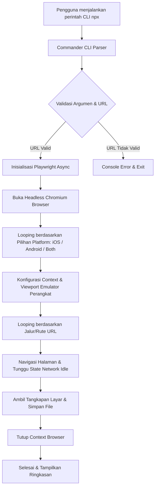

# MobileSnap 📸

MobileSnap adalah alat CLI (Command Line Interface) berbasis Node.js yang dirancang untuk mengotomatisasi pengambilan tangkapan layar (screenshot) App Store & Google Play Store dengan presisi piksel tinggi langsung dari server pengembangan lokal (seperti Astro, Next.js, React, atau Vue).

### 📱 Contoh Output (Mockup Premium)

Berikut adalah visualisasi nyata dari tangkapan layar yang dibungkus otomatis ke dalam bingkai mockup perangkat premium (menggunakan opsi `-m` atau `--mockup`):

| iOS (iPhone 6.7" Pro Max) | Android Phone (Google Pixel 7) |
| :---: | :---: |
|  |  |

---

## 🏗️ Arsitektur Sistem

MobileSnap dirancang dengan fokus pada efisiensi, keandalan, dan kemudahan penggunaan. Berikut adalah diagram alur kerja utama aplikasi:



### Komponen Utama

1. **Parser CLI ([bin/cli.js](file:///d:/Deweb/MobileSnap/bin/cli.js))**: Menggunakan library `Commander` untuk memproses input parameter dari pengguna secara intuitif.
2. **Mesin Otomatisasi Browser**: Berbasis `Playwright` untuk menjalankan proses Chromium tanpa kepala (*headless*).
3. **Pengaturan Emulator Presisi**:
   - **Skala Perangkat (DPI)**: Ditetapkan ke `deviceScaleFactor: 3` untuk menghasilkan kualitas tangkapan layar yang sangat tajam (Retina/High DPI) sesuai standar rilis.
   - **Agen Pengguna (User Agent)**: Dikonfigurasi dinamis sesuai platform target (iOS menggunakan user agent iPhone, Android menggunakan user agent Google Pixel 7).
4. **Sinkronisasi Hidrasi Web**: Menggunakan `page.waitForLoadState("networkidle")` untuk mendeteksi ketika semua aset selesai dimuat sebelum tangkapan layar diambil. Ini sangat penting untuk framework modern seperti Astro.

---

## 📱 Spesifikasi Dimensi Target

MobileSnap secara otomatis mengambil gambar untuk perangkat berikut berdasarkan platform yang dipilih:

### iOS (Apple App Store)
| Nama Layar | Resolusi (Piksel) | Rasio Aspek | Output File Contoh |
| :--- | :--- | :--- | :--- |
| **6.7" Display** | 1290 x 2796 | 19.5:9 | `6.7_inch_home.png` |
| **6.5" Display** | 1242 x 2688 | 19.5:9 | `6.5_inch_home.png` |

### Android (Google Play Store)
| Nama Layar | Resolusi (Piksel) | Rasio Aspek | Output File Contoh |
| :--- | :--- | :--- | :--- |
| **Android Phone** | 1080 x 2400 | 20:9 | `android_phone_home.png` |
| **Android Tablet (10")** | 1600 x 2560 | 16:10 | `android_tablet_home.png` |

---

## 🚀 Cara Penggunaan Instan (NPX)

Anda tidak perlu menginstal apa pun secara permanen. Cukup jalankan perintah menggunakan `npx`:

```powershell
# 1. Jalankan langsung dari server lokal Anda
npx mobile-snap --url http://localhost:4321
```

> [!NOTE]
> Jika ini adalah pertama kalinya Anda menjalankan Playwright, Anda mungkin perlu mengunduh browser binaries dengan menjalankan perintah:
> ```powershell
> npx playwright install chromium
> ```

Jika Anda ingin menginstalnya secara global di sistem Anda:
```powershell
npm install -g mobile-snap
```

---

## 💻 Panduan Penggunaan CLI

Aplikasi ini menerima opsi utama berikut:

| Parameter | Singkatan | Deskripsi | Standar (Default) | Pilihan |
| :--- | :--- | :--- | :--- | :--- |
| `--url` | `-u` | **(Wajib)** URL server lokal. | - | - |
| `--paths` | `-p` | Jalur/rute halaman yang dipisahkan tanda koma. | `/` | - |
| `--output`| `-o` | Nama direktori tempat menyimpan gambar. | `mobilesnap_output` | - |
| `--platform`| `-l`| Platform target tangkapan layar. | `ios` | `ios`, `android`, `both` |
| `--crawl` | `-c` | Mengaktifkan penelusuran (crawl) otomatis tautan internal di halaman beranda. | `false` | - |
| `--detect-pages` | `-d` | Memindai direktori halaman lokal (`src/pages` atau `pages`) untuk rute statis. | `false` | - |
| `--email` | - | Email untuk autentikasi otomatis. | - | - |
| `--password` | - | Password untuk autentikasi otomatis (disensor di terminal). | - | - |
| `--login-path`| - | Jalur rute ke halaman login. | `/login.html` | - |
| `--html` | - | Otomatis menambahkan akhiran `.html` pada rute statis terdeteksi. | `false` | - |
| `--mockup` | `-m` | Membungkus tangkapan layar dalam bingkai mockup perangkat (iPhone/Android) yang premium dengan status bar dan bayangan transparan. | `false` | - |

### Contoh Perintah

#### 1. Pengambilan Halaman iOS Saja (Default)
```powershell
npx mobile-snap --url http://localhost:4321
```

#### 2. Pengambilan Halaman Android Saja dengan Mockup Bingkai Perangkat
```powershell
npx mobile-snap --url http://localhost:4321 --platform android --mockup
```

#### 3. Pengambilan Rute Tertentu untuk 2 Platform Sekaligus
Mengambil gambar halaman utama `/` dan halaman `/scan` untuk kedua platform sekaligus ke folder `hasil_store`:
```powershell
npx mobile-snap --url http://localhost:4321 --paths "/, /scan" --platform both --output hasil_store
```

#### 4. Auto-Crawl Halaman Web & Login Interaktif dengan Mockup Bingkai Perangkat
Menelusuri semua tautan internal secara otomatis dari beranda dan memotret setiap halaman yang ditemukan dengan bingkai mockup iPhone/Android:
```powershell
npx mobile-snap --url http://localhost:4321 --crawl --platform both --mockup
```


#### 5. Auto-Detect Rute Proyek Lokal (Astro / Next.js) dengan Auto-Login
Jika Anda berada di dalam root direktori proyek Astro Anda, jalankan perintah ini untuk mendeteksi secara otomatis semua rute halaman statis dari folder `src/pages` dengan login otomatis:
```powershell
npx mobile-snap --url http://localhost:4321 --detect-pages --html --email "user@email.com" --password "rahasia"
```

---

## 🔐 Autentikasi Otomatis & Interaktif

MobileSnap secara cerdas membedakan halaman publik dan halaman terproteksi (yang membutuhkan login) berdasarkan pengalihan client-side ke rute login.

Jika terdeteksi rute yang memerlukan login, MobileSnap akan:
1. **Meminta Kredensial Secara Interaktif**: Jika opsi `--email` dan/atau `--password` tidak diberikan lewat CLI, sistem akan menanyakan email dan password secara interaktif di terminal dengan sensor password otomatis demi keamanan.
2. **Auto-Login**: MobileSnap akan melakukan proses sign-in sebelum mengambil tangkapan layar untuk semua rute terproteksi.
3. **Crawl Pasca-Login**: Jika opsi `--crawl` aktif, MobileSnap juga akan menjelajahi menu dan tautan internal yang baru muncul di dashboard pasca-login.

---

## ℹ️ Bantuan Perintah (`--help`)

Anda selalu dapat memanggil opsi bantuan langsung dari terminal dengan menjalankan:

```powershell
npx mobile-snap --help
```

Output bantuan resmi:
```text
Usage: mobile-snap [options]

⚡ MobileSnap CLI: Automate App Store & Google Play Store screenshots

Options:
  -V, --version              output the version number
  -u, --url <url>            Base URL of the local development server (e.g. localhost:3000)
  -p, --paths <paths>        Comma-separated list of routes to capture (default: "/")
  -o, --output <output>      Output directory to save screenshots (default: "mobilesnap_output")
  -l, --platform <platform>  Target platform: "ios", "android", or "both" (default: "ios")
  -c, --crawl                Discover and screenshot all internal links automatically (default: false)
  -d, --detect-pages         Scan local project pages directory (src/pages or pages) for static routes (default: false)
  --email <email>            Email for automatic login authentication
  --password <password>      Password for automatic login authentication
  --login-path <path>        Path to the login page (default: "/login.html")
  --html                     Auto append .html extension to detected routes (default: false)
  -m, --mockup               Wrap screenshots in a beautiful iPhone/Android device mockup frame (default: false)
  -h, --help                 display help for command
```


