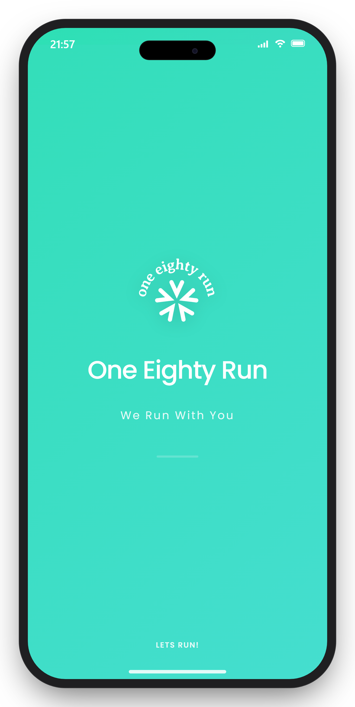
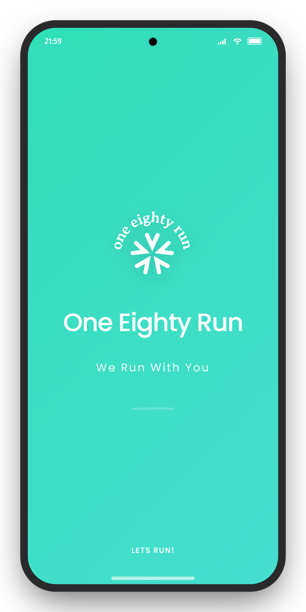
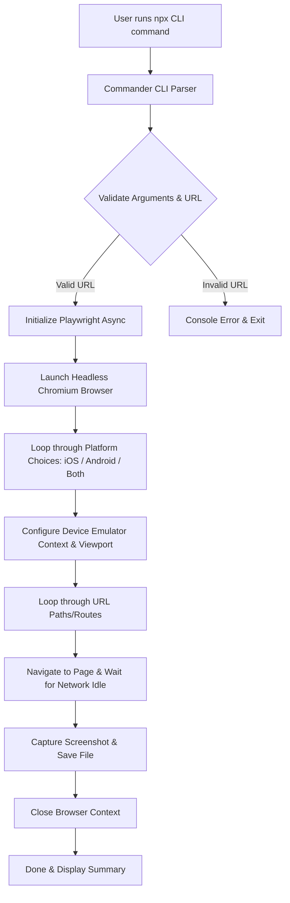

# MobileSnap 📸

MobileSnap is a Node.js-based CLI (Command Line Interface) tool designed to automate the capture of pixel-precise App Store and Google Play Store screenshots directly from local development servers (such as Astro, Next.js, React, or Vue).

### 📱 Sample Output (Premium Mockups)

Below is a real-world visualization of screenshots automatically wrapped in premium device mockup frames (using the `-m` or `--mockup` option):

| iOS (iPhone 6.7" Pro Max) | Android Phone (Google Pixel 7) |
| :---: | :---: |
|  |  |

---

## 🏗️ System Architecture

MobileSnap is designed with a focus on efficiency, reliability, and ease of use. Below is the main workflow diagram of the application:



### Main Components

1. **CLI Parser ([bin/cli.js](file:///d:/Deweb/MobileSnap/bin/cli.js))**: Uses the `Commander` library to process user input parameters intuitively.
2. **Browser Automation Engine**: Powered by `Playwright` to run headless Chromium instances.
3. **Precision Emulator Configuration**:
   - **Device Scale (DPI)**: Set to `deviceScaleFactor: 3` to produce ultra-sharp screenshots (Retina/High DPI) meeting official store release guidelines.
   - **User Agent**: Configured dynamically based on the target platform (iOS uses an iPhone user agent; Android uses a Google Pixel 7 user agent).
4. **Web Hydration Synchronization**: Employs `page.waitForLoadState("networkidle")` to detect when all page assets are fully loaded before capturing the screenshot. This is crucial for modern frameworks like Astro.

---

## 📱 Target Dimension Specifications

MobileSnap automatically captures screenshots for the following devices based on the selected platform:

### iOS (Apple App Store)
| Display Name | Resolution (Pixels) | Aspect Ratio | Sample Output File |
| :--- | :--- | :--- | :--- |
| **6.7" Display** | 1290 x 2796 | 19.5:9 | `6.7_inch_home.png` |
| **6.5" Display** | 1242 x 2688 | 19.5:9 | `6.5_inch_home.png` |

### Android (Google Play Store)
| Display Name | Resolution (Pixels) | Aspect Ratio | Sample Output File |
| :--- | :--- | :--- | :--- |
| **Android Phone** | 1080 x 2400 | 20:9 | `android_phone_home.png` |
| **Android Tablet (10")** | 1600 x 2560 | 16:10 | `android_tablet_home.png` |

---

## 🚀 Instant Usage (NPX)

You do not need to install anything permanently. Simply run the command using `npx`:

```powershell
# 1. Run directly against your local dev server
npx mobile-snap --url http://localhost:4321
```

> [!NOTE]
> If this is your first time running Playwright, you may need to download the browser binaries by running:
> ```powershell
> npx playwright install chromium
> ```

To install it globally on your system:
```powershell
npm install -g mobile-snap
```

---

## 💻 CLI Usage Guide

The application accepts the following main options:

| Option | Alias | Description | Default | Choices |
| :--- | :--- | :--- | :--- | :--- |
| `--url` | `-u` | **(Required)** Local development server URL. | - | - |
| `--paths` | `-p` | Comma-separated list of routes to capture. | `/` | - |
| `--output`| `-o` | Name of the directory to save screenshots. | `mobilesnap_output` | - |
| `--platform`| `-l`| Target platform for screenshots. | `ios` | `ios`, `android`, `both` |
| `--crawl` | `-c` | Enable automatic discovery (crawling) of internal links on the home page. | `false` | - |
| `--detect-pages` | `-d` | Scan local project pages directory (`src/pages` or `pages`) for static routes. | `false` | - |
| `--email` | - | Email for automatic authentication. | - | - |
| `--password` | - | Password for automatic authentication (hidden in terminal). | - | - |
| `--login-path`| - | Route path to the login page. | `/login.html` | - |
| `--html` | - | Automatically append `.html` extension to detected static routes. | `false` | - |
| `--mockup` | `-m` | Wrap screenshots in beautiful, premium device mockup frames (iPhone/Android) with status bars and transparent drop shadows. | `false` | - |

### Command Examples

#### 1. Capture iOS Only (Default)
```powershell
npx mobile-snap --url http://localhost:4321
```

#### 2. Capture Android Only with Device Mockup Frame
```powershell
npx mobile-snap --url http://localhost:4321 --platform android --mockup
```

#### 3. Capture Specific Routes for Both Platforms
Captures the home page `/` and page `/scan` for both platforms simultaneously into the `hasil_store` directory:
```powershell
npx mobile-snap --url http://localhost:4321 --paths "/, /scan" --platform both --output hasil_store
```

#### 4. Auto-Crawl Website & Interactive Login with Device Mockup Frame
Recursively crawls all internal links from the home page and captures each discovered page with a mockup frame:
```powershell
npx mobile-snap --url http://localhost:4321 --crawl --platform both --mockup
```

#### 5. Auto-Detect Local Project Routes (Astro / Next.js) with Auto-Login
If you are inside the root directory of your Astro/Next.js project, run this command to automatically detect all static page routes from the pages folder and capture them with auto-login:
```powershell
npx mobile-snap --url http://localhost:4321 --detect-pages --html --email "user@email.com" --password "rahasia"
```

---

## 🔐 Automatic & Interactive Authentication

MobileSnap intelligently distinguishes between public pages and protected pages (requiring authentication) based on client-side redirects to the login route.

If a route requiring login is detected, MobileSnap will:
1. **Prompt for Credentials Interactively**: If `--email` and/or `--password` options are not supplied via the CLI, the tool will prompt for them in the terminal, masking the password input for security.
2. **Auto-Login**: MobileSnap performs the sign-in sequence before capturing screenshots for all protected routes.
3. **Post-Login Crawl**: If the `--crawl` option is enabled, MobileSnap will also discover and crawl internal links that only become visible in the dashboard post-authentication.

---

## ℹ️ Command Help (`--help`)

You can display the help information directly from the terminal by running:

```powershell
npx mobile-snap --help
```

Official help output:
```text
Usage: mobile-snap [options]

⚡ MobileSnap CLI: Automate App Store & Google Play Store screenshots

Options:
  -V, --version              output the version number
  -u, --url <url>            Base URL of the local development server (e.g.
                             localhost:3000)
  -p, --paths <paths>        Comma-separated list of routes to capture
                             (default: "/")
  -o, --output <output>      Output directory to save screenshots (default:
                             "mobilesnap_output")
  -l, --platform <platform>  Target platform: "ios", "android", or "both"
                             (default: "ios")
  -c, --crawl                Discover and screenshot all internal links
                             automatically (default: false)
  -d, --detect-pages         Scan local project pages directory (src/pages or
                             pages) for static routes (default: false)
  --email <email>            Email for automatic login authentication
  --password <password>      Password for automatic login authentication
  --login-path <path>        Path to the login page (default: "/login.html")
  --html                     Auto append .html extension to detected routes
                             (default: false)
  -m, --mockup               Wrap screenshots in a beautiful iPhone/Android
                             device mockup frame (default: false)
  -h, --help                 display help for command
```
